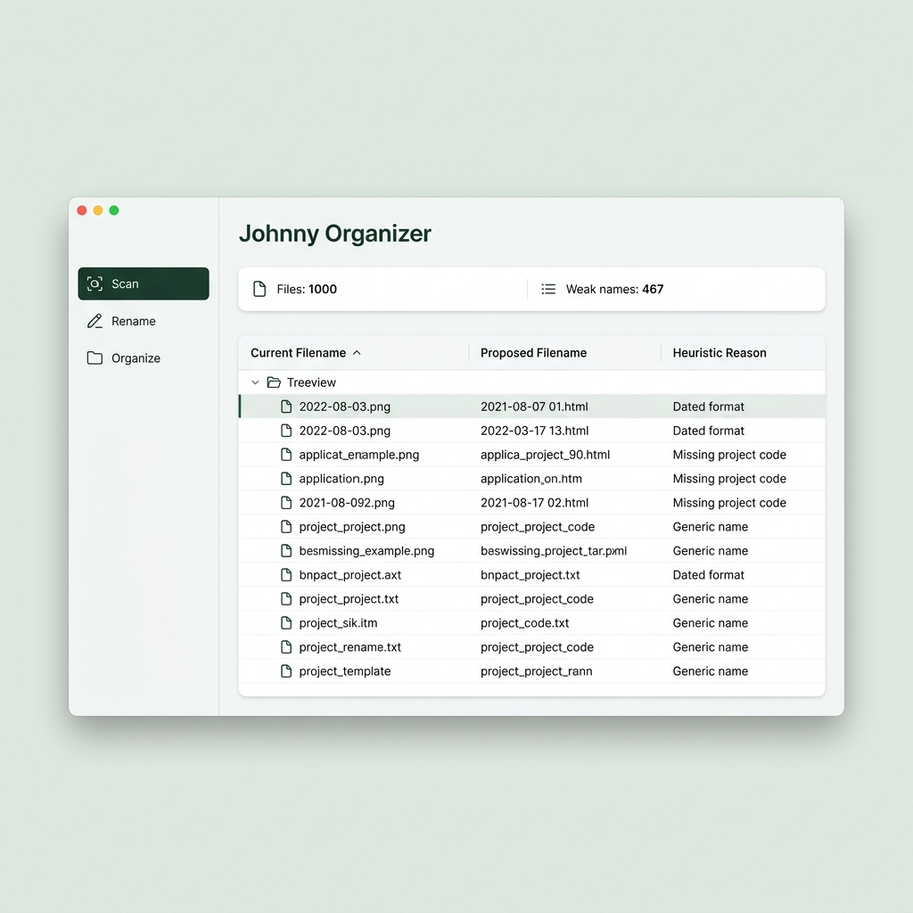

# Johnny Organizer

Safety-first file renaming and [Johnny.Decimal](https://johnnydecimal.com/) organization for messy local folders.

Johnny Organizer scans a folder, proposes cleaner file names, and sorts files into `NN.NN_Category` folders. Everything runs locally. It previews before it changes anything, never overwrites a file, and logs every rename and move so a run can be reversed.

> **Status: experimental.** The rename and move safety layer is tested; semantic routing quality depends on the category profiles you provide. See [Known limitations](#known-limitations).

## Features

- **Scan** a folder into a CSV inventory without touching any file.
- **Quick rename** (`johnny/rename/filename_standardizer.py`): deterministic, filename-only cleanup. It skips ambiguous names on purpose, keeps dates, version numbers and names intact, and never truncates silently.
- **Deep rename** (`johnny/rename/rename_engine.py`): context-aware names for vague files (`document 2.txt`, `scan_001.pdf`) using the folder path, document text and a local embedding model.
- **Category plan**: builds a weighted evidence summary of your files and a handoff file you can use to author a taxonomy (`master_index.json`).
- **Semantic routing** (`johnny/core/nlp_engine.py`): matches files to your categories with local sentence-transformer embeddings and abstains into `Unsorted_Miscellaneous` when unsure.
- **Rule pre-pass** (`johnny/core/planner.py`): before routing, software and environment folders (virtual environments, `node_modules`, git projects) are moved whole as one unit to `_Software_Projects`, and temporary files go to `_Temp_Safe_To_Remove` (regenerable: thumbnail caches, lock files, `*.tmp`, `*.pyc`) or `_Temp_Review_First` (backups, logs, partial downloads). Nothing is deleted, and the original folder structure is kept inside those folders.
- **Guarded apply**: organization is blocked when more than `floor(routed files / 150)` files would land in `Unsorted_Miscellaneous`. Files handled by the rule pre-pass are not counted.
- **Undo log**: every rename and move is written to `undo_log.jsonl`; reverse a run with `python -m johnny.core.utils --apply`.
- **Desktop UI** (`johnny/ui/jd_ui_prototype.py`, Tkinter) and equivalent command-line tools.

## Screenshot



*Design mockup used while building the interface. It is not a live screenshot of the current window.*

## Setup

Tested on Windows 11 with Python 3.14.

```powershell
git clone <repository-url>
cd <repository-folder>
pip install -r requirements.txt
```

Dependencies (`requirements.txt`): `scikit-learn`, `PyPDF2`, `python-docx`, `sentence-transformers` (downloads the `intfloat/multilingual-e5-base` model on first use), `pywin32` (only needed by the Windows-only backup index tool). Tkinter ships with Python on Windows.

Create your own index from the example (it is git-ignored so your category names stay private):

```powershell
copy master_index.example.json master_index.json
```

Optional: `local_hints.example.json` shows how to give the Quick renamer a few personal name or place hints. Copy it to `local_hints.json` (git-ignored) and edit.

## Usage

**Desktop UI**

```powershell
python -m johnny.ui.jd_ui_prototype
```

Pick a folder, then work through *Scan, Rename, Organize*. Every step has a preview; nothing changes until you press an Apply button.

**Command line** (previews are read-only)

```powershell
python -m johnny.scan.scan_drive "D:\Some Folder"                         # writes runs/session_<name>/drive_scan.csv
python -m johnny.rename.filename_standardizer "D:\Some Folder" --dry-run    # Quick rename preview
python -m johnny.rename.rename_files "D:\Some Folder" --dry-run             # Deep rename preview
python -m johnny.organize.organizer "D:\Some Folder" --index master_index.json --read-only
python -m johnny.core.utils                                               # preview undoing the last run
python -m johnny.core.utils --apply                                       # undo it
```

Drop `--dry-run` / `--read-only` to apply. Files are moved into `NN.NN_Category` folders next to the index file.

**Category profiles.** Routing quality depends on each category having a profile in the index (`profiles` in `master_index.json`: a description, aliases and example file names). Without one, a category is matched on its name only, and the tool warns you. `master_index.example.json` shows the format.

## How it fits together

Short module map (full detail in [ARCHITECTURE.md](ARCHITECTURE.md)): `johnny/rename/filename_standardizer.py` and `johnny/rename/rename_engine.py` rename; `johnny/core/nlp_engine.py` and `johnny/core/embedding_manager.py` score categories; `johnny/organize/router.py` moves files; `johnny/core/index_manager.py` reads and writes the index; `johnny/core/utils.py` holds the shared safe rename/move and undo log; `johnny/organize/organizer.py` and `johnny/ui/jd_ui_prototype.py` are the command-line and desktop front ends.

## Tests

```powershell
python -m unittest discover -s tests -v     # fast regression suite, no model download needed
python tests/routing_benchmark.py           # on demand: routing accuracy / abstention vs a stored baseline
```

The suite covers rename, move, undo, index handling, scanning, text extraction, the command-line organizer and the Tk UI flow and layout.

## Measured results

The Quick rename figures come from a private set of file names, so that input is not published. The routing benchmark uses the fixture in `fixtures/`.

| Check | Result |
|---|---|
| Quick rename, 1,000 labelled filenames | precision 1.00, skip safety 1.00, recall about 0.07 (conservative by design) |
| Routing benchmark, 25 labelled cases (included), with category profiles | accuracy 0.84 using name, path and text; 0.92 using name and path only |
| Same benchmark without profiles | accuracy 0.52 / 0.60, with many files abstained into `Unsorted_Miscellaneous` |

## Known limitations

- Experimental software: back up important folders and preview before applying. Undo is best effort.
- Quick rename has low recall by design; many weak names are left unchanged.
- Routing needs per-category profiles. The abstention margin (`routing_calibration.json`) is tuned on a small fixture and is deliberately strict.
- Text extraction supports `.txt`, `.pdf` (text layer only) and `.docx`. There is no OCR, and images are routed on file name and path.
- Windows is the primary platform. The backup identity index is Windows-only.
- Organized files are moved into the folder that contains the index file, not into the scanned folder.
- The desktop window clips some controls at small sizes (below roughly 1366x768).
- Scanning lists hidden files; the UI skips them.
- Month ranges such as `Jan-Mar 2023` keep only the year when renaming.
- The test suites are small; the routing fixture has only 25 cases.

## Excel trial workbooks

Trial workbooks: **link to be added** (Google Drive).
<!-- REPLACE: add the Google Drive link for the Excel trial workbooks here before publishing. -->

## Support

If this project is useful to you, you can support its development.


<!-- REPLACE: add donate/donate_support.png before publishing. -->

[Donation link](https://drive.google.com/file/d/14KBkEcr6j4KaxDHcHyejdYlFDt4GjR6O/view?usp=drive_link)

## License

[MIT](LICENSE) (c) 2026 Nishant Agarwal
